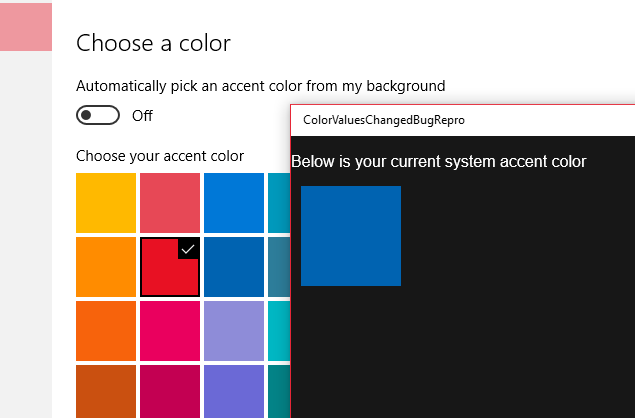

# ColorValuesChangedBugRepro
A bug repro for Windows.UI.ViewManagement.UISettings

Related discussions: [GitHub issue](https://github.com/Microsoft/Windows-universal-samples/issues/114), [MSDN 1](https://social.msdn.microsoft.com/Forums/en-US/2a1e3d21-17a1-47d1-9783-6f4e97900f96/uisettingscolorvalueschanged?forum=wpdevelop), [MSDN 2](https://social.msdn.microsoft.com/Forums/en-US/f5242c51-4f15-42b0-b430-45428b78cc57/bug-repro-on-uisettingscolorvalueschanged?forum=wpdevelop)

### Environment

* Windows 10
* Visual Studio 2015

### Repro process

1. Deploy the app
2. Go Settings->Personalization->Colors and change accent color
3. Check if the app shows the changed one correctly
4. If not it means the event is broken, but check if tapping Windows button fixes it
5. The event is completely broken if nothing works

### Screenshot

